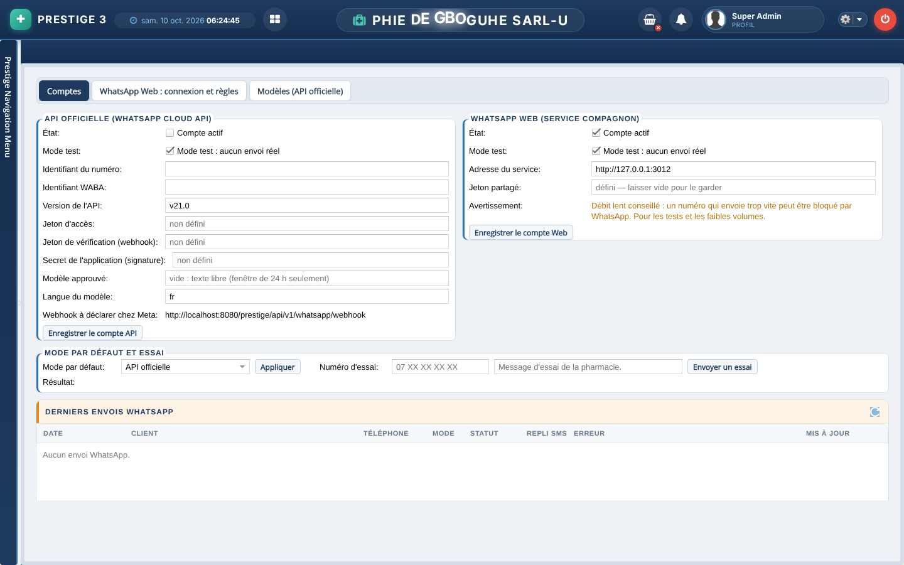
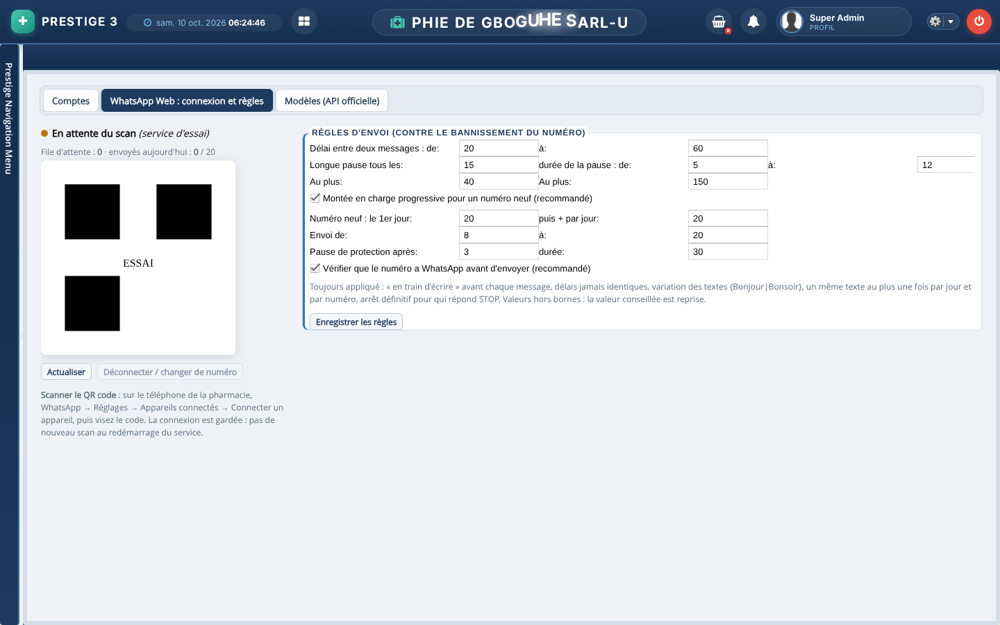
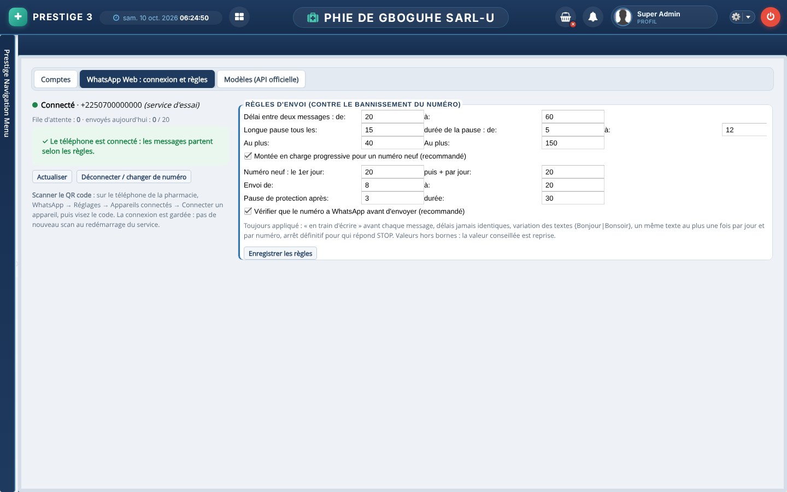

# Notice — envoyer les messages WhatsApp par WhatsApp Web

Cette notice fait passer de « Service non configuré » à « Connecté » en une quinzaine de minutes. Elle concerne le mode
**WhatsApp Web** : le numéro WhatsApp de la pharmacie est connecté par QR code, comme sur un ordinateur. L'autre mode,
l'**API officielle** de Meta, se règle dans l'onglet *Comptes* avec les identifiants du compte Meta Business.

> Le mode WhatsApp Web convient aux faibles volumes (rappels, renouvellements). Un envoi massif peut faire bannir le
> numéro par WhatsApp : les règles d'envoi de l'étape 5 limitent ce risque. Elles sont appliquées automatiquement.

## Ce qu'il faut

- Le **poste serveur** de la pharmacie, celui où tourne Prestige, avec **Node.js 18 ou plus récent**.
- Le **téléphone** de la pharmacie, avec WhatsApp sur le numéro qui doit envoyer les messages.
- Le dossier `outils/whatsapp-web` du dépôt Prestige. C'est le **service compagnon** : un petit programme à part qui
  tient la session WhatsApp. Prestige ne voit jamais cette session.

## 1. Installer le service compagnon (une fois)

1. Copier `outils/whatsapp-web` sur le poste serveur, par exemple dans `C:\prestige\whatsapp-web`.
2. Dans ce dossier, lancer `npm install --omit=dev`.
3. Créer le fichier `config.json` à côté de `package.json` :
   ```json
   { "PORT": 3010,
     "JETON": "<une phrase secrète d'au moins 16 caractères>",
     "PRESTIGE_WEBHOOK": "http://localhost:8080/prestige/api/v1/whatsapp/webhook-web",
     "DOSSIER": "C:/prestige/whatsapp-web-donnees" }
   ```
   - Le **jeton** est le mot de passe partagé entre Prestige et le service. Notez-le : il sert à l'étape 3.
   - Ce fichier ne doit jamais être envoyé dans Git (il est déjà ignoré) ni par messagerie.

## 2. Le lancer comme service Windows

Le service doit redémarrer tout seul avec le poste. Deux façons de faire :

- **NSSM** :
  ```
  nssm install PrestigeWhatsApp "C:\Program Files\nodejs\node.exe" "C:\prestige\whatsapp-web\src\serveur.js"
  ```
  Indiquez `C:\prestige\whatsapp-web` comme répertoire de démarrage, puis lancez `nssm start PrestigeWhatsApp`.
- **pm2** :
  ```
  pm2 start src/serveur.js --name prestige-whatsapp && pm2 save
  ```
  Complétez avec `pm2-installer` sous Windows.

Le journal du service doit afficher : **« service WhatsApp Web sur le port 3010 »**. Le service n'écoute que sur
`127.0.0.1` : il n'est pas joignable depuis le réseau.

## 3. Déclarer le compte dans Prestige

Menu **Paramétrage WhatsApp**, onglet **Comptes**, bloc **WhatsApp Web** :



- **Adresse** : `http://127.0.0.1:3010`
- **Jeton** : le même que dans `config.json`. Une fois enregistré, il n'est plus jamais réaffiché.
- **Compte actif** : à cocher.
- **Mode test** : à laisser coché pour un premier essai sans envoi réel, puis à décocher.
- Cliquez **Enregistrer**.

## 4. Connecter le téléphone (scan du QR code)

Onglet **WhatsApp Web : connexion et règles**. L'état indique **« En attente du scan »** et un QR code s'affiche :



Sur le téléphone de la pharmacie, ouvrez WhatsApp › **Réglages** › **Appareils connectés** › **Connecter un appareil**,
puis visez le QR code. Quelques secondes plus tard, l'écran se rafraîchit seul et affiche
**« Connecté · +225… »** :



La connexion est gardée : il n'y a pas de nouveau scan à faire après un redémarrage du poste. Pour changer de numéro,
cliquez **Déconnecter / changer de numéro**, puis scannez à nouveau.

> Les captures ci-dessus ont été faites avec le service d'essai (`WHATSAPP_FAUX=1`). Son QR code factice porte
> « ESSAI » et ne se scanne pas. Pour refaire ces captures :
> `node src/test/e2e/retours/captures-notice-whatsapp.js`.

## 5. Règles d'envoi

Ce bloc est à droite du même onglet. Les valeurs conseillées sont déjà en place :

- un délai aléatoire de 20 à 60 s entre deux messages ;
- une longue pause toutes les 15 à 40 messages ;
- des plafonds par heure et par jour ;
- une montée en charge progressive pour un numéro neuf ;
- un envoi de 8 h à 20 h seulement.

Une valeur hors bornes est ramenée à la valeur conseillée. **Enregistrer les règles** les transmet au service.

## 6. Envoyer

Les rappels de traitement (menu *Rappels traitement*), les renouvellements d'ordonnance et les campagnes proposent
trois canaux :

- **Par WhatsApp** ;
- **Par WhatsApp, SMS si WhatsApp échoue** ;
- **Par SMS**.

Le modèle de message se choisit dans la barre ; les modèles se gèrent dans *Modèles de messages*. Les statuts
(envoyé, distribué, lu, échec) remontent dans **Derniers envois WhatsApp**.

## En cas de problème

| Message ou symptôme | Cause | Que faire |
|---|---|---|
| « Service non configuré » | Aucun compte WhatsApp Web actif dans Prestige | Étape 3 |
| « Service injoignable » | Le service compagnon est arrêté, ou l'adresse est fausse | Vérifier le service Windows (étape 2) et l'adresse `http://127.0.0.1:3010` |
| « Jeton refusé » | Le jeton n'est pas le même dans Prestige et dans `config.json` | Ressaisir le jeton dans l'onglet Comptes |
| Le QR code ne s'affiche pas | Le premier démarrage est lent (le navigateur intégré se télécharge) | Patienter une minute, puis **Actualiser** |
| « Déconnecté » après quelques jours | Le téléphone a retiré l'appareil connecté | Refaire l'étape 4 |
| Messages en attente le soir | Hors des heures d'envoi | Ils partent à la réouverture (8 h) |

## Sécurité

- Le jeton n'est jamais renvoyé au navigateur ni écrit dans les journaux. Le texte des messages n'est jamais
  journalisé.
- Le dossier `DOSSIER/session` contient la session WhatsApp : il faut le protéger comme un mot de passe.
- Le dossier `DOSSIER/file.json` garde la file d'envoi, avec le texte des messages, 7 jours au plus. Ce délai sert aux
  accusés de réception et au contrôle des doublons.

Détails techniques (routes, format `{"id", "to", "text"}`, tests) : `outils/whatsapp-web/README.md`.
